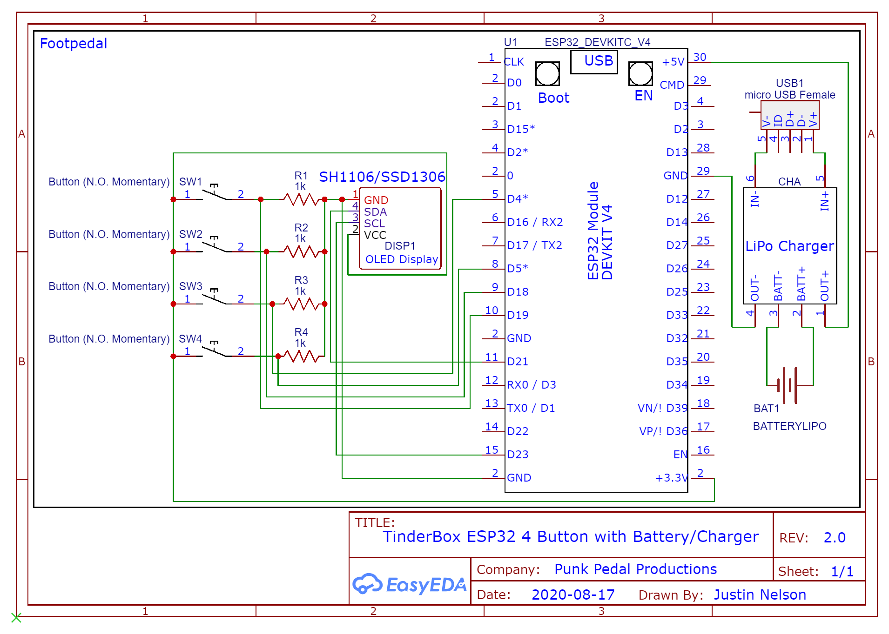

# tinderboxpedal
Bluetooth "Universal Remote" Footpedal for Digital Guitar Amps, on ESP32 or Pi Zero W

Tone Demo Video: https://www.youtube.com/watch?v=tqi_EmIKPC0

https://github.com/jrnelson90/tinderboxpedal/wiki/Basic-Project-Q&A

## Enivronment Setup Notes:
* So far only tested with the Positive Grid Spark 40 Amp
* Pi version has so far only tested to run on the latest Raspberry Pi OS 32-bit lite image on Pi Zero W and Pi 4B (https://www.raspberrypi.org/documentation/installation/installing-images/README.md).
* **Raspberry Pi OS Lite Setup:** https://github.com/jrnelson90/tinderboxpedal/wiki/Raspberry-Pi-OS-Lite-Setup
* ESP32 version has so far only been tested in Arduino IDE with the MELIFE Dev Board (https://www.amazon.com/gp/product/B07Q576VWZ). **Please check your specific ESP32 dev board pinouts if attempting to use this version.**
* **Full ESP32 Arduino-Core Setup coming soon!**

On client, edit `tinderbox.py` or `tinderbox.ino` to match your GPIO mapping or OLED screen type before running.
On demo server (to run on another Pi if you don't have a Spark yet), edit `demoLedServer.py` to match your LED GPIO mapping before running.

## Basic Schematics:
### Raspberry Pi Schematic

### ESP32 Schematic
**In this code pins 4, 5, 18, and 19 are used for button input. Your ESP32 dev board's GPIO layout may be different, so please double-check after wiring and before running!**

## Essential Parts Needed:
- Raspberry Pi Zero W + SD Card (at least 8GB) **or** ESP32 Dev Board
- USB Power Supply (2.5 Amps)
- 128x64 I2C OLED (SSD1306 or SH1106)
- 4x SPST Normally Open Momentary Switches

## Other Parts Used In Justin's First Pi Prototype:
- Prototype PCB
- 2x Female 1/8" (3.5mm) TRS Sockets
- 2x Male 1/8" (3.5mm) TRS Couplings
- 2x Male 1/4" (6.35mm) TRS to Female 1/8" (3.5mm) TRS Adapters
- Female Pin Header for the Display
- 2x20 40-Pin Female Pin Header Socket Connector
- Hammond 1590B Enclosure
- Raspberry Pi Power Switch Cable

