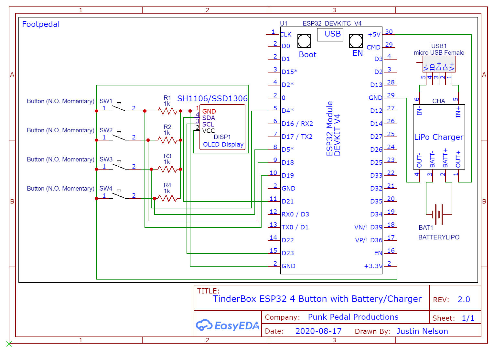

# tinderboxpedal
Bluetooth "Universal Remote" Footpedal for Digital Guitar Amps, on ESP32 or Pi Zero W

Tone Demo Video: https://www.youtube.com/watch?v=tqi_EmIKPC0

https://github.com/jrnelson90/tinderboxpedal/wiki/Basic-Project-Q&A

## Enivronment Setup Notes:
* So far only tested with the Positive Grid Spark 40 Amp
* Pi version has so far only tested to run on the latest Raspberry Pi OS 32-bit lite image on Pi Zero W and Pi 4B (https://www.raspberrypi.org/documentation/installation/installing-images/README.md).
* **ESP32 Setup:** https://github.com/jrnelson90/tinderboxpedal/wiki/ESP32-Arduino-Core-Setup-for-TinderBox-ESP-v0.3.1
* **Raspberry Pi OS Lite Setup:** https://github.com/jrnelson90/tinderboxpedal/wiki/Raspberry-Pi-OS-Lite-Setup
* **Please check your specific ESP32 dev board pinouts if attempting to use this version.**

On client, edit `tinderbox.py` or `tinderbox.ino` to match your GPIO mapping or OLED screen type before running.
On demo server (to run on another Pi if you don't have a Spark yet), edit `demoLedServer.py` to match your LED GPIO mapping before running.

## Basic Schematics:

### ESP32 Schematic
**In this code pins 4, 5, 18, and 19 are used for button input. Your ESP32 dev board's GPIO layout may be different, so please double-check after wiring and before running!**

### Raspberry Pi Schematic

## Essential Parts Needed:
- Raspberry Pi Zero W + SD Card (at least 8GB) **or** ESP32 Dev Board
- USB Power Supply (2.5 Amps)
- 128x64 I2C OLED (SSD1306 or SH1106)
- 4x SPST Normally Open Momentary Switches

## Other Parts Used In Justin's First Pi Prototype:
- Prototype PCB
- 2x Female 1/8" (3.5mm) TRS Sockets
- 2x Male 1/8" (3.5mm) TRS Couplings
- 2x Male 1/4" (6.35mm) TRS to Female 1/8" (3.5mm) TRS Adapters
- Female Pin Header for the Display
- 2x20 40-Pin Female Pin Header Socket Connector
- Hammond 1590B Enclosure
- Raspberry Pi Power Switch Cable

## Other great projects used in this include:
### Pi
* Luma: https://github.com/rm-hull/luma.core
* Pillow: https://github.com/python-pillow/Pillow

### ESP32
* ESP32 Arduino-Core:  https://github.com/espressif/arduino-esp32
* Thingpulse SSD1306/SH1106 ESP Driver: https://github.com/ThingPulse/esp8266-oled-ssd1306
* ButtonFever: https://github.com/mickey9801/ButtonFever

### Wireless Sniffing
* Wireshark: https://github.com/wireshark/wireshark

## License

Copyright 2020 TinderBox Pedal Project and Justin Nelson

Licensed under the Apache License, Version 2.0 (the "License");
you may not use this file except in compliance with the License.
You may obtain a copy of the License at

    http://www.apache.org/licenses/LICENSE-2.0

Unless required by applicable law or agreed to in writing, software
distributed under the License is distributed on an "AS IS" BASIS,
WITHOUT WARRANTIES OR CONDITIONS OF ANY KIND, either express or implied.
See the License for the specific language governing permissions and
limitations under the License.
