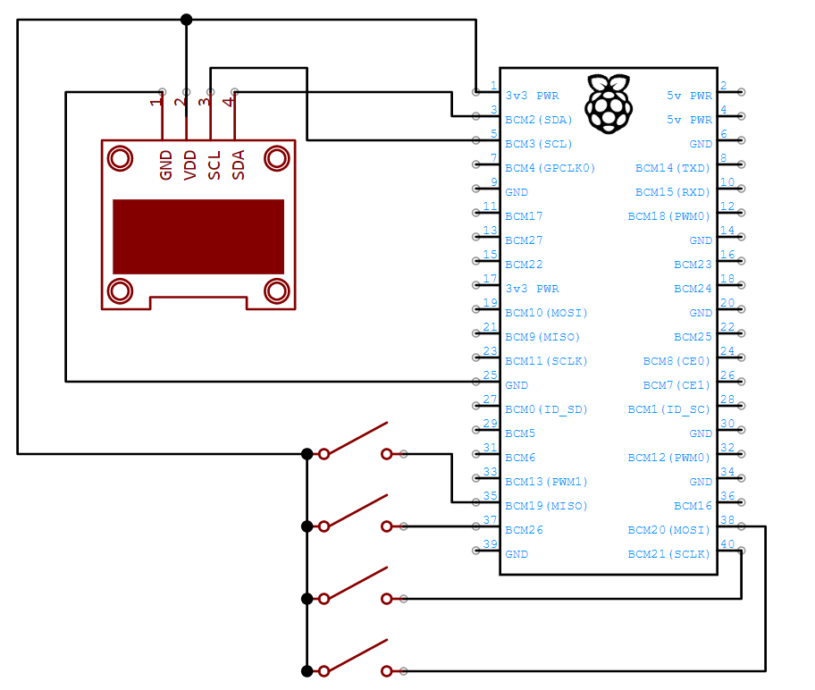
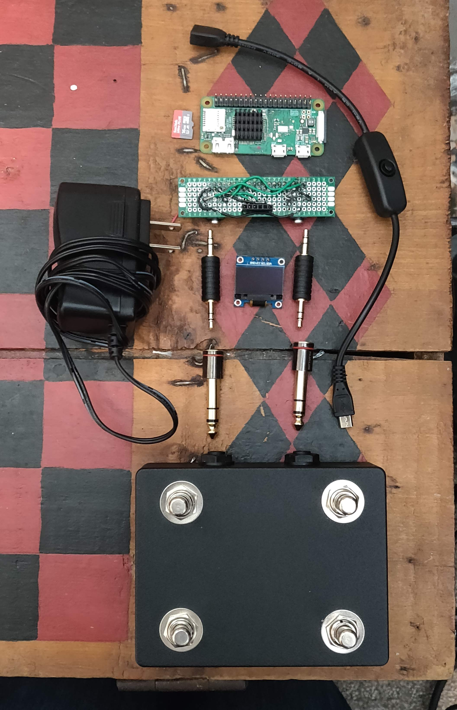
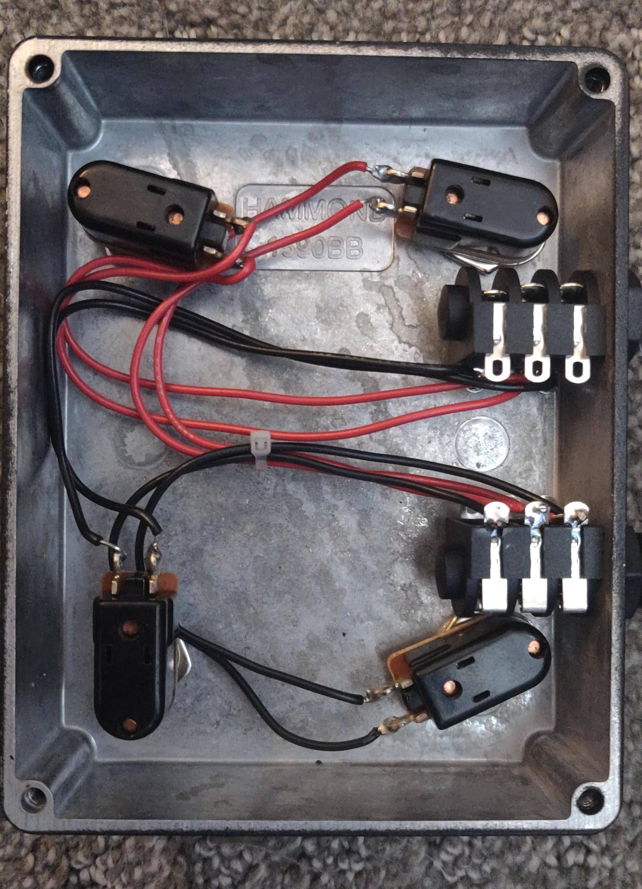

# tinderboxpedal
BT "Universal Remote" Control Code for Digital Guitar Amps

## Enivronment Setup Notes:

* So far only tested with the Positive Grid Spark 40 Amp
* So far only tested to run on the latest Raspberry Pi OS 32-bit lite image on Pi Zero W and Pi 4B (https://www.raspberrypi.org/documentation/installation/installing-images/README.md).
* `setupLinux.sh` will install necessary Python, I2C, BT, and GPIO libraries.
* Add `DisablePlugins = pnat` to `/etc/bluetooth/main.conf` post setup install to ensure proper BT pairing.
* Make sure I2C and Bluetooth are enabled, SSH is recommended for headless development

On client, edit `tinderbox.py` to match your GPIO mapping or OLED screen type before running.

On demo server, edit `demoLedServer.py` to match your LED GPIO mapping before running.

## Basic Schematic:

## Essential Parts Needed:
- Raspberry Pi Zero W
- SD Card (at least 8GB)
- Pi Power Supply
- 128x64 I2C OLED
- 4x SPST Normally Open Momentary Switches

## Other Parts Used In Justin's Prototype:
- Prototype PCB
- 2x Female 1/8" (3.5mm) TRS Sockets
- 2x Male 1/8" (3.5mm) TRS Couplings
- 2x Male 1/4" (6.35mm) TRS to Female 1/8" (3.5mm) TRS Adapters
- Female Pin Header for the Display
- 2x20 40-Pin Female Pin Header Socket Connector
- Hammond 1590B Enclosure
- Raspberry Pi Power Switch Cable

